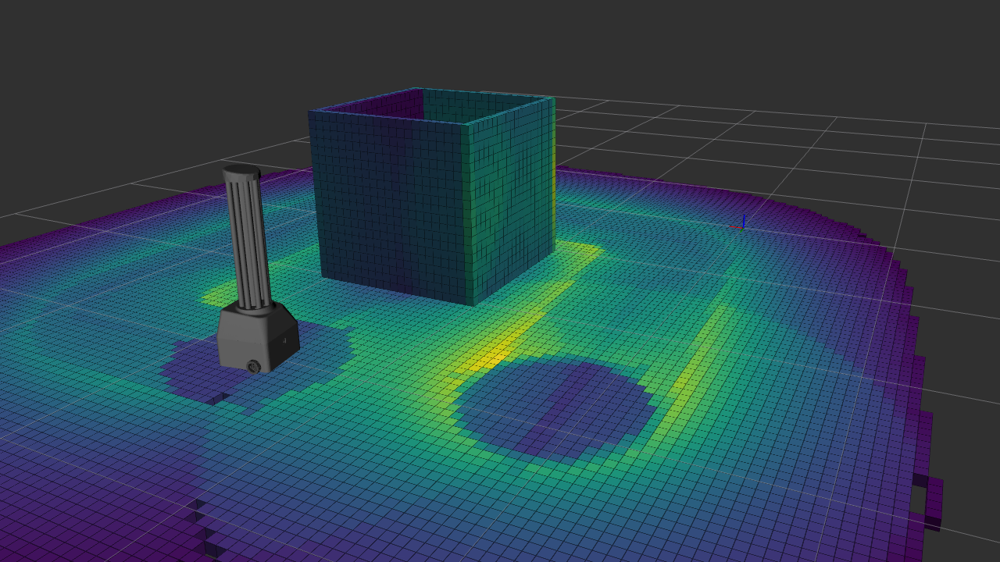
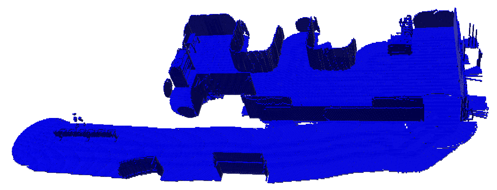
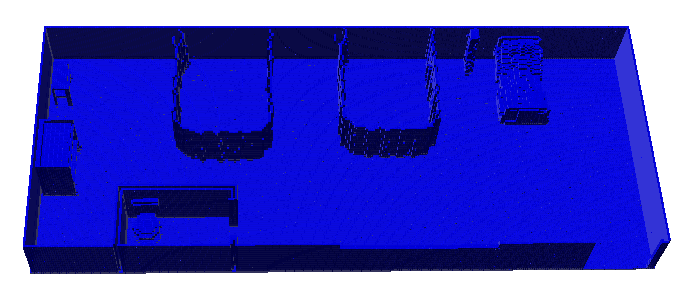
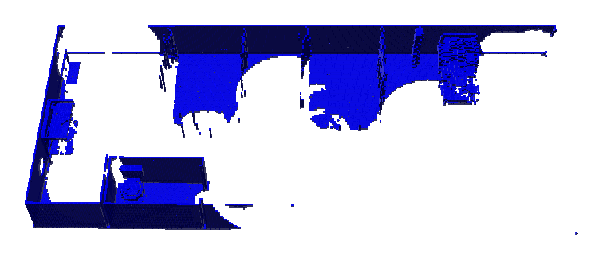

# `soca_octomap`
**Author:** [Irfan Tito Kurniawan](https://github.com/titoirfan)

An ultraviolet-C (UV-C) irradiation simulation and evaluation implementation in Gazebo and ROS. The simulation is made possible by modelling the UV-C irradiation system as a 3D LIDAR and representing the environment as a voxel map. The evaluation functionality compares the irradiation simulation result to a reference map of the environment to calculate the total irradiation coverage.

  

   

### Related Publications:
Irfan Tito Kurniawan, Widyawardana Adiprawita. **A Method of Ultraviolet-C Surface Irradiation Simulation and Evaluation**. Unpublished (Submitted).

Irfan Tito Kurniawan, Widyawardana Adiprawita. **Autonomy Design and Development for an Ultraviolet-C Healthcare Surface Disinfection Robot**. Unpublished (Submitted).

# 1. Acknowledgement
The development of this software won't be possible without the following open-source libraries and tools
- [octomap](https://github.com/OctoMap/octomap)
- [octomap_mapping](https://github.com/OctoMap/octomap_mapping)
- [octomap_ros](https://github.com/OctoMap/octomap_ros)
- [octomap_msgs](https://github.com/OctoMap/octomap_msgs)
- [octomap_rviz_plugins](https://github.com/OctoMap/octomap_rviz_plugins)
- [velodyne_simulator](https://bitbucket.org/DataspeedInc/velodyne_simulator/src/master/)
- [hector_localization](https://github.com/tu-darmstadt-ros-pkg/hector_localization)
- [rotors_simulator](https://github.com/ethz-asl/rotors_simulator)
- [tinycolormap](https://github.com/yuki-koyama/tinycolormap)

# 2. Prerequisite

We have tested the implementation in Ubuntu 20.04 with ROS Noetic and Gazebo 11.1.0.

## C++11 Compiler
We use functionalities provided by C++11.

## Octomap
You will need to install [Octomap](https://octomap.github.io/) separately in your system.

# 3. Building soca_octomap

Create a catkin workspace
```bash
mkdir -p catkin_ws/src && cd ./catkin_ws/src
```

Clone the repository
```bash
git clone https://github.com/titoirfan/soca_octomap
```

Build and source the repository
```bash
cd .. && catkin_make && source ./devel/setup.bash 
```

# 4. Usage

## Simulation
1. Add a 3D LIDAR link and P3D ground truth pose publisher to your URDF and Gazebo model. See `example.urdf.xacro` and `example.gazebo.xacro` for reference.
2. Run the `message_to_tf` to create a `tf` expressing the ground truth pose between the map frame and the LIDAR link.
3. Run the Dose Octomap Server node.
4. When a satisfactory Dose Octomap is obtained, save the Dose Octomap using the Dose Octomap Saver node.

## Evaluation
1. Add the RotorS' Octomap Builder plugin to the `world` file of your environment. See the third line of `block_and_cylinder.world` for reference.
```xml
<!-- Add these anywhere between world tags -->
<plugin name='gazebo_octomap' filename='libBuildOctomapPlugin.so'/>
```
2. Generate the binary ground truth Octomap of the environment by calling the plugin's service. Please note that the Octomap sizes should match and you may have to tune the z-origin parameter. See the example section for more information.
3. Run the heatmap evaluator node for the full Dose Octomap file to be evaluated against the binary ground truth Octomap.

# 5. Example

We provided a simple example of a static platform irradiating a simple model cubes and cylinder.

## Simulation

1. Make and source the repository
```bash
cd catkin_ws && source ./devel/setup.bash
```
2. Run the example launchfile to set up the simulation environment. This will spawn the example platform defined in `example.urdf.xacro` in the environment `block_and_cylinder.world`. It will also run the `message_to_tf` node.
```bash
roslaunch soca_octomap example.launch
```
3. Run RViz
```bash
rosrun rviz rviz -d ./src/soca_octomap/soca_octomap/example/rviz/example.rviz
```
4. Launch the Dose Octomap Server node
```bash
roslaunch soca_octomap octomap_dose_mapping.launch
```
5. Save the Dose Octomap once a satisfactory result is obtained
```bash
# Save full map
rosrun soca_octomap octomap_dose_saver_node -f ./src/soca_octomap/soca_octomap/example/octomap/meas_octomap.ot
# Save binary map
rosrun soca_octomap octomap_dose_saver_node ./src/soca_octomap/soca_octomap/example/octomap/meas_octomap.bt
```

## Evaluation

1. Make and source the repository
```bash
cd catkin_ws && source ./devel/setup.bash
```
2. Generate a ground truth reference Octomap of the environment while Gazebo is simulating the environment. You might have to remove any platforms or robots you have in the field. The bounding box length is centered around the origin (e.g. x origin of 0 and x bounding box length of 5 will get you an x range of -2.5 to 2.5). Make sure to set `fill_closed_spaces` to false to get a surface map of the environment. Note that the size has to match the measured Dose Octomap, you might also have to tune the z-origin to match the coordinates. 
```bash
rosservice call /world/build_octomap '{bounding_box_origin: {x: 0.0, y: 0, z: 0.5}, bounding_box_lengths: {x: 5.0, y: 5.0, z: 2.05}, leaf_size: 0.05, filename: $(PATH_TO_CATKIN_WS)/src/soca_octomap/soca_octomap/example/octomaps/ref_octomap.bt, fill_closed_spaces: false}'
```
3. Edit the file paths and area bounds in `heatmap_eval.config` and launch the evaluator node
```bash
roslaunch soca_octomap heatmap_eval.launch
```
4. You can then visualize the difference Octomap
```bash
octovis ./src/soca_octomap/soca_octomap/example/octomaps/diff_octomap.bt
```
